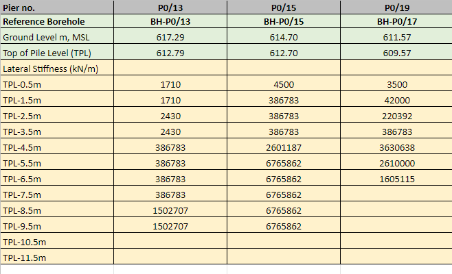

## Mulitple Pile lateral capacity STAAD-script compiler

This program was written to automate the task of calculating the lateral capacity of many piles at once. 
Usually the earlier process was to model one pile with all the lateral stiffness and apply the load/deflection at pile head to calculate the pile lateral stiffness.
This program allows to model all the piles are once in a single file allowing to find the lateral capacity of all the piles all at once. 

Here is a short presentation on how this automation process works:

1. First the script takes input of a excel file containing all the pile lateral stiffness values as shown below: 



2. Then program returns the STAAAD script that includes from modelling the piles to performing the analysis: 
```
STAAD SPACE
START JOB INFORMATION
ENGINEER DATE 11-Mar-22
END JOB INFORMATION
INPUT WIDTH 79
UNIT METER KN
JOINT COORDINATES
100 0 0
101 0 -0.5 0 111 0 -11.5 0
200 10 0
201 10 -0.5 0 210 10 -10.5 0
300 20 0
301 20 -0.5 0 307 20 -7.5 0
.
.
.
.
PERFORM ANALYSIS
FINISH
```
3. This script can be copy-pasted in the STAAD pro and it will generate the pile models with lateral spring configuration, load configuration etc. 
4. Run the analysis as it is and you can extract the results for each pile

## Summary of the program
- Models multiple piles with specified lateral stiffeness values at each depth of each pile with applied 5mm deflection at each pile/scoket
- Calculates the pile lateral capacity at once.


[**Run the code on google colab**](https://colab.research.google.com/github/kavyajeetbora/civil_engineering/blob/master/pile_lateral_capacity/Lateral_Capacity_v6.ipynb)
